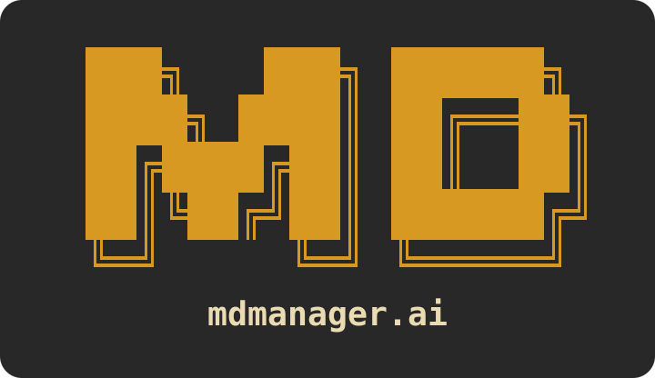
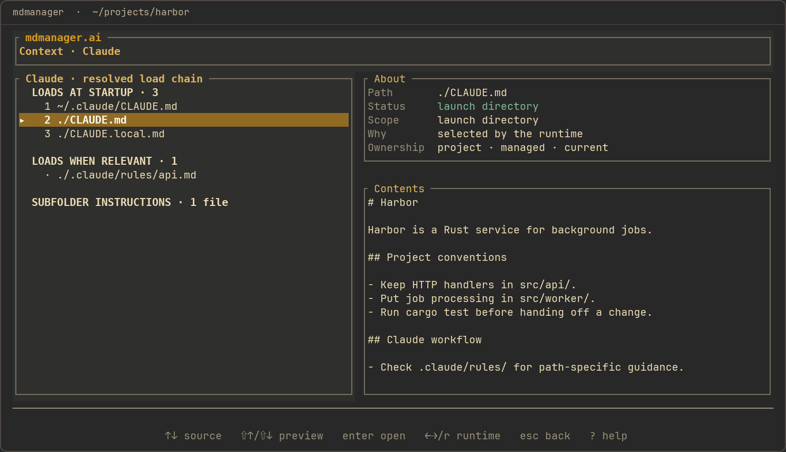
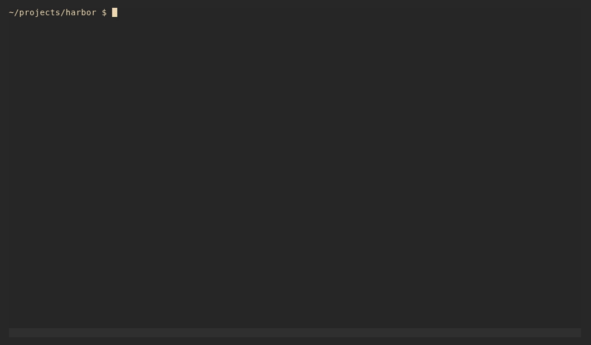

<p align="center">
  
</p>

<p align="center">
  <strong>Know what your coding agent reads.</strong>
</p>

<p align="center">
  Manage your <code>CLAUDE.md</code> and <code>AGENTS.md</code> files with reusable sections.<br>
  Ask your coding agent to organize them, then review its changes in mdmanager.
</p>

<p align="center">
  Claude Code · Codex · Cursor · Pi
</p>

<p align="center">
  <a href="#get-started">Get started</a> ·
  <a href="#work-with-your-coding-agent">Demo</a> ·
  <a href="#documentation">Documentation</a>
</p>

<p align="center">
  
</p>

Claude and Codex may share your coding conventions, but each also needs instructions of its own.
Your work laptop needs a different global setup from a machine running hosted agents. Project files
add another layer.

mdmanager lets you reuse the shared Markdown and choose what each runtime gets. Named Global
Profiles keep different setups organized, and Context brings global and project instruction sources
into one view.

## Shared instructions, with room for differences

A Section is an ordinary Markdown file you can reuse in several compositions. Each target has its
own ordered list of Sections, so Claude and Codex can share conventions while keeping their
runtime-specific instructions separate.

For example:

| Section | Claude | Codex |
| --- | --- | --- |
| Coding conventions | Included | Included |
| Rust conventions | Included | Included |
| Claude-specific instructions | Included | |
| Codex-specific instructions | | Included |

Edit a shared Section once, then review and apply the affected targets.

If you already have instruction files, your agent can adopt them into mdmanager while preserving
their deployed contents.

## A Global Profile for each setup

Your work laptop might need company conventions and instructions for interactive development. A
hosted agent machine might need instructions for unattended work.

Give each setup a named Global Profile. Each Profile selects the runtime targets it deploys and the
Sections included in each target.

```sh
mdmanager apply work-laptop --yes
```

On the hosted machine:

```sh
mdmanager apply hosted --yes
```

Profiles and personal Sections can live in your dotfiles. You handle getting those files onto each
machine; mdmanager applies the chosen Profile there.

## Read global and project instructions together

Open mdmanager inside a repository and choose Context. You can browse the instruction sources for
your selected runtime, with their loading order and contents visible in the same screen.

Context explains why an override takes precedence, which rules load conditionally, and whether a
source is excluded or truncated. Switch runtimes to compare their instruction chains.

You can inspect existing files immediately, without configuring mdmanager or adopting them.

```sh
mdmanager context --runtime claude
mdmanager context --runtime codex --json
```

Context describes persistent instruction Markdown on disk for a new session. It does not inspect a
running conversation or its system prompt.

## Keep personal instructions out of shared project files

Choose the scope that fits the instructions:

| Scope | What belongs here | Where it lives |
| --- | --- | --- |
| **Global** | Your personal defaults for this machine | Profiles and Sections under `~/.mdmanager/`, applied to configured runtime paths |
| **Project** | Instructions the team shares | Sources under `.mdmanager/` and generated instruction files, committed with the repository |
| **Local** | Your private instructions for one repository | Personal compositions under `~/.mdmanager/projects/`, with ignored instruction files in the checkout |

Project compositions stay self-contained, so teammates don't need your personal library. Local
compositions can reuse your personal Sections across repositories.

Project and Local management require a Git worktree. Runtime behavior still applies: Codex and Pi's
`AGENTS.override.md` replaces `AGENTS.md`, while Claude's `CLAUDE.local.md` adds instructions. Cursor
has no Global Markdown target.

## Work with your coding agent

Point your coding agent to the setup guide:

```sh
mdmanager docs start
```

Then tell it what you want changed. For example:

> Read `mdmanager docs start` and help me organize my Claude and Codex instructions. Reuse the shared
> coding conventions and keep runtime-specific instructions separate. Prepare the changes for me to
> review before applying.

Open `mdmanager` in your terminal to check the result. Browse the sources and review differences
while the agent works; the TUI reloads automatically as files change.

<p align="center">
  
</p>

When you're happy with the changes, ask the agent to apply them. You can also authorize it to apply
from the outset.

Editing a source changes the proposed composition. Apply updates the instruction file your runtime
reads. Status shows when changes are waiting to be applied or when someone has edited a managed
target directly.

The agent performs instruction edits and Apply through the CLI. You use the TUI to inspect its work.

## Get started

Building from source requires Rust 1.91.1 or newer:

```sh
git clone https://github.com/manuelschipper/mdmanager.git
cd mdmanager
cargo install --path .
```

Open it in the repository you want to inspect:

```sh
cd /path/to/your/repository
mdmanager
```

Then ask your coding agent to read `mdmanager docs start` and describe the setup you want.

To prepare a personal Section library with Global Claude and Codex targets:

```sh
mdmanager init claude codex
```

Initialization creates the configuration without deploying instructions.

## Documentation

The guides also ship inside the binary:

```sh
mdmanager docs
mdmanager docs start
mdmanager docs context
```

| Guide | Covers |
| --- | --- |
| [Start](docs/start.md) | Set up mdmanager with your coding agent |
| [Context](docs/context.md) | Understand discovered instructions and ownership |
| [Concepts](docs/concepts.md) | Work with Sections, Profiles, and scopes |
| [TUI](docs/tui.md) | Browse documents, review differences, and choose a theme |
| [Configuration](docs/configuration.md) | Configure manifests and runtime targets |
| [CLI](docs/cli.md) | Use management commands and machine-readable output |
| [Migrate](docs/migrate.md) | Adopt existing instructions |

See the [documentation index](docs/README.md) for runtime-specific guides.
Release notes are in the [changelog](CHANGELOG.md).

## Develop

```sh
cargo test
cargo clippy --all-targets -- -D warnings
cargo fmt --all -- --check
```

The development toolchain is pinned to Rust 1.91.1. [DESIGN.md](DESIGN.md) describes the architecture
and ownership rules.

## License

[MIT](LICENSE)
